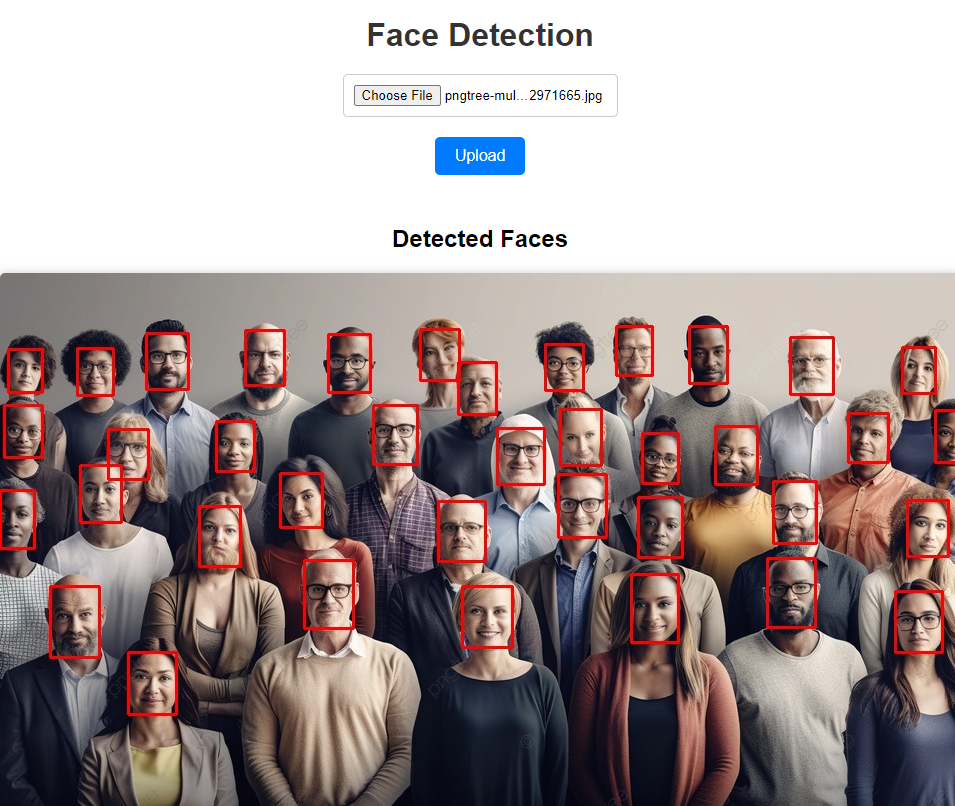

# Face Detection API

This project is a Flask-based web service for face detection using the YOLOv8 model.

## Features
- Face detection from uploaded images
- Real-time face detection from camera feed
- Adjustable confidence threshold and input size via API
- Display detection results on images and video stream

## Requirements
- Python 3.9
- Flask
- OpenCV
- ONNX Runtime
- Pillow

## Installation
1. Clone repository:
    ```bash
    git clone https://github.com/PongpreechaSuea/FaceDetection.git
    cd FaceDetection
    ```
2. Create and activate virtual environment:
    ```bash
    python -m venv venv
    source venv/bin/activate  # For Windows use `venv\Scripts\activate`
    ```
3. Install required packages:
    ```bash
    pip install -r requirements.txt
    ```

## Configuration
Customize the `src/config.py` file as needed:
```python
MODEL = "./model/yolov8n-face.onnx"
IMAGE_PATH = "image_debug.jpg"
IOU = 0.58
REG_MAX = 16
STRIDES = (8, 16, 32)
CONF = 0.3
IMGSIZE = 480
FREE_SPACE = 20 
HOST = "0.0.0.0"
PORT = 3000
```

## Usage
### Starting the Server

Start the FastAPI server:

```cmd
python app.py
```
The server will run on http://0.0.0.0:3000 by default.

## API Endpoints
### Upload and Detect Faces from Image

- Endpoint: /upload
- Method: POST
- Description: Upload an image and detect faces
- Request: multipart/form-data
    
    - file: Image for face detection


- Response: JSON with detection results and base64 encoded image

## Adjust Settings

- Endpoint: /seting
- Method: POST
- Description: Adjust confidence threshold and input size
- Request: Query parameters

    - conf_threshold: New confidence threshold value
    - input_size: New input size


- Response: JSON with status of the operation

## Stream Video from Camera

- Endpoint: /video_feed
- Method: GET
- Description: Stream video from camera with real-time face detection
- Response: multipart/x-mixed-replace stream

## Test Web Pages

- /upload: Page for uploading images
- /webcam: Page for opening camera and real-time face detection


## Docker Support
This project includes Docker support for easy deployment.

## Building and Running with Docker

Build the Docker image:
```cmd
docker build -t face-detection-app .
```

Run the container:
```cmd
docker run -p 3000:3000 face-detection-app
```

## Using Docker Compose
Alternatively, you can use Docker Compose:
``` bash
docker-compose up --build
```

This will build the image and start the container, mapping port 3000 on your host to port 3000 in the container.

## Example Output

<p align="center">
  
</p>
